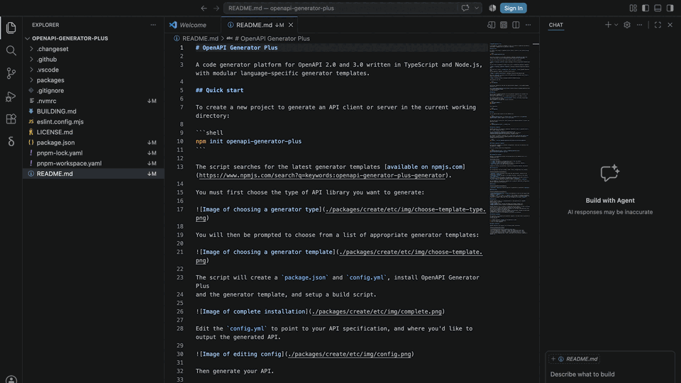

# Changelog

## 1.0.1

### Tower integration

- Launching a comparison from Tower now opens a new window in your running
  VS Code instead of starting a second copy of the app.

### Compare Branches

- Compare any two branches from the welcome screen: two filterable dropdowns
  list the repository's branches and load lazily once the panel appears.
- Type inline to filter each list; **Compare Branches** activates once two
  distinct branches are chosen and opens their diff (`left..right`).

## 1.0.0

### Compare from any window

- Opening the Delta Flow view in an ordinary VS Code window now shows a welcome
  screen instead of the “no data provider registered” message.
- Start **Diff Working Tree** or **Diff Pull Request** straight from it when the
  folder is Git managed; a note explains when Git features do not apply.
- **Diff Working Tree** appears only when there are uncommitted changes; beside
  it, **Diff vs `<base>`** compares the current branch with the branch it was
  checked out from (inferred from the closest fork point, remembered per project).
- Comparisons now open inside the current window, so your project stays put in
  the Explorer rather than a separate diff window taking its place.
- **New Comparison** in the Changed Files title bar returns to the welcome
  screen, and each comparison cleans up after itself when it is replaced or the
  window closes.

### Compare Directories

- Compare any two directories from the welcome screen — no Git repository
  required.
- Type absolute or relative paths, press **Tab** to complete them, or pick a
  folder with **Browse…** (which opens at the path already entered).
- **Compare Directories** enables once both paths resolve to readable
  directories; a directory you cannot read explains why in a tooltip.
- Honours each directory’s own `.gitignore`, so build output, dependencies, and
  other ignored files stay out of the comparison.

## 0.1.1

### Review GitHub pull requests

- Run **Delta Flow: Diff Pull Request** to list the repository’s open pull
  requests (requires `gh`).
- Compare the PR head with its target branch in a focused Delta Flow window.
- See the PR number, title, author, draft status, source branch, and target
  branch in the picker.
- PRs targeting the checked-out branch are marked and prioritised.
- Optionally group the picker by author, draft status, or target branch with
  `deltaFlow.pullRequestGrouping`.
- Get a clear installation prompt, authentication command, and link when the
  GitHub CLI (`gh`) is unavailable.

The PR picker requires an installed and authenticated
[GitHub CLI](https://cli.github.com/). Run `gh auth login` after installation.

### More useful comparison windows

- PR windows use descriptive titles containing the PR number, title, author,
  and draft status.
- Working-tree comparisons are titled **Working Tree Changes**.
- Tower and direct `git difftool` comparisons resolve branch, tag, remote
  branch, or commit names when Git exposes them, with a repository-name
  fallback.
- Delta Flow now opens a named folder rather than a `.code-workspace` file, so
  VS Code no longer appends “(Workspace)” to comparison titles.

### Improved session file management

- Comparison sessions now live beneath one stable per-user cache root:
  `.../delta-flow/sessions`.
- Session launchers sweep sessions older than three days, and uninstalling the
  extension removes the remaining Delta Flow session cache.

### Smoother Workspace Trust (Restricted Mode)

- Although Delta Flow remains fully functional in Restricted Mode, we now give
  some guidance about how to remove the banner.
- A one-time in-product hint links directly to Workspace Trust management.

### Tower integration lifecycle

- Installed Tower launchers support upgrades and extension
  rollbacks.
- **Delta Flow: Uninstall Tower Integration** removes Delta Flow’s Tower
  registration and launcher.
- Uninstalling the VS Code extension also removes the Tower integration after
  VS Code restarts.

### Release workflow

- After a successful `npm run release`, the release script creates a
  lightweight tag named `release/YYYY/MM/v<version>` using the local release
  date.

## 0.1.0

Initial release.

- Changed Files tree for a whole Git directory changeset, opened from Tower or
  `git difftool --dir-diff`.
- Git-powered add / change / delete / rename / copy detection, with moved files
  shown in both their old and new folders.
- Read-only diffs for the temporary Git/Tower snapshots; text, image (side-by-side
  for SVG), and binary-aware handling.
- Whitespace-only changes flagged in the tab title and tree.
- Docked, live filter panel: path globs, changed-line search, and per-status
  toggle icons.
- Keyboard navigation through the tree.
- One-command Tower integration for macOS and Windows.
