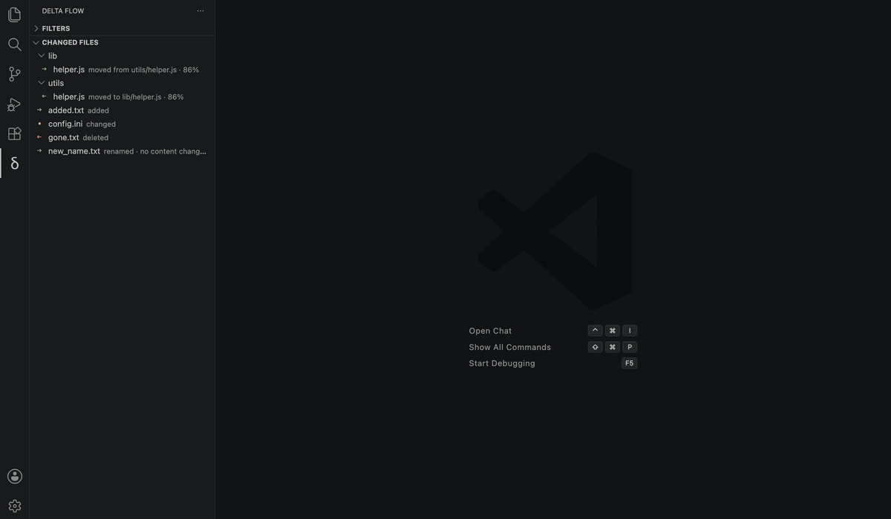
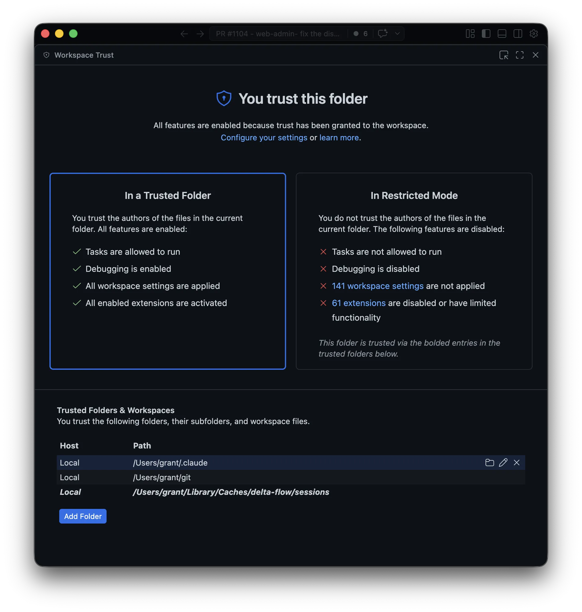

# Delta Flow

The directory diff viewer that lives where you already work: VS Code, Git, and
Tower.

[Release notes](RELEASE_NOTES.md)

Delta Flow turns a Git directory diff into a clear, read-only file tree inside
VS Code. It is built for the moments when a line-by-line diff is too narrow:
large refactors, migrations, file moves, generated changes, and changesets where
the shape of the tree matters as much as the content.

Browse every file that was added, changed, deleted, moved, renamed, or copied,
then select a file to open its diff in VS Code.

## Get Started

1. Install **[Delta Flow](https://marketplace.visualstudio.com/items?itemName=grantyb.delta-flow)**
   from the VS Code Marketplace.
2. Open a Git repository in VS Code.
3. Run **Delta Flow: Diff Working Tree** from the Command Palette.

Delta Flow opens the current working-tree changes as a navigable directory diff
in a new VS Code window.

To review an open GitHub pull request, run **Delta Flow: Diff Pull Request** and
choose one from the repository's list. This requires the
[GitHub CLI](https://cli.github.com/) to be installed and authenticated.
Pull requests targeting the checked-out branch are marked and shown first. Set
`deltaFlow.pullRequestGrouping` to group the picker by author, draft status, or
base branch.

## Highlights

- A focused Changed Files tree for the whole Git changeset
- A pull request picker for comparing an open PR with its target branch
- Rename, copy, and move detection powered by Git
- Read-only diffs for temporary Git/Tower directory snapshots
- Text, image, and binary-aware diff handling
- Keyboard navigation, path filtering, and changed-line search
- One-command Tower integration for macOS and Windows

## The Restricted Mode banner

Each comparison opens in its own private working directory, so VS Code starts the
window in [Restricted Mode](https://code.visualstudio.com/docs/editor/workspace-trust)
and shows a banner. Delta Flow only reads the two directory snapshots and never
runs workspace code, so diffs work the same either way — but you can silence the
banner for good.

Every comparison opens beneath a single per-user folder — `.../delta-flow/sessions`
in your cache directory (`~/Library/Caches` on macOS, `%LOCALAPPDATA%` on Windows,
`${XDG_CACHE_HOME:-~/.cache}` on Linux). Trust that folder once and every future
comparison opens trusted:

1. Run **Workspaces: Manage Workspace Trust** from the Command Palette (or click
   **Manage** in the banner).
2. Under **Trusted Folders**, add the `.../delta-flow/sessions` folder.

## Connect Tower

Run **Delta Flow: Install Tower Integration** from the Command Palette, then
restart Tower and choose **Delta Flow** in **Settings > Git Config**.

Tower can then open any commit, branch comparison, or working-tree changeset
directly in Delta Flow.

Uninstalling the extension also removes its Tower integration after VS Code
restarts. To remove only the integration, run **Delta Flow: Uninstall Tower
Integration**.
